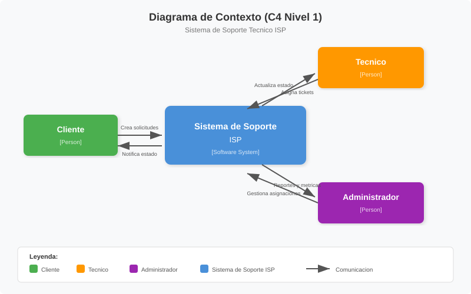

# Estilo Arquitectonico Distribuido

## 1. Propuesta

El sistema de soporte tecnico ISP se propone como una **arquitectura distribuida** compuesta por procesos independientes que se comunican mediante mecanismos de interproceso.

La decision de采用arquitectura distribuida se justifica porque un sistema centralizado presenta un **punto unico de fallo**: si el componente central deja de funcionar, todo el servicio de soporte se cae. En cambio, una arquitectura distribuida con **componentes separados (interfaz, logica, datos)** permite que cada parte evolucione y funcione de forma independiente.

> **Fuente:** E2, cap. 1.1.3 — justificacion de arquitectura distribuida vs. centralizada (cita literal).

En esta primera entrega (E1) **no se definen los microservicios exactos**. Lo que se establece es:

- El estilo arquitectonico general (distribuido).
- Los mecanismos de comunicacion entre procesos (sockets TCP y gRPC).
- El modelo de ordenamiento de eventos (reloj logico de Lamport).

> **Nota:** La definicion explicita de microservicios, contenedores y orquestacion corresponde a la entrega E2.

## 2. Decisiones arquitectonicas de E1

| Decision | Descripcion | Estado |
|----------|-------------|--------|
| Estilo arquitectonico | Distribuido (procesos independientes) | Definido en E1 |
| Mecanismo de comunicacion #1 | Sockets TCP | Prototipado en E1 |
| Mecanismo de comunicacion #2 | gRPC | Prototipado en E1 |
| Modelo de ordenamiento | Reloj logico de Lamport | Implementado en E1 |
| Numero de microservicios | No definido explicitamente | Pendiente para E2 |
| Contenedores (Docker) | No definidos | Pendiente para E2 |
| Mensajeria (Kafka) | No definida | Pendiente para E2 |

> **Fuente:** Tabla 1.3 del documento E2 (comparativa entre entregas).

## 3. Diagrama de contexto (nivel 1)

Ver [c4-nivel1-contexto-soporte-tecnico.svg](diagrams/c4-nivel1-contexto-soporte-tecnico.svg) para el diagrama completo.

Tres actores interactuan con el sistema:
- **Cliente** — crea solicitudes, recibe notificaciones de estado.
- **Tecnico** — recibe asignaciones, actualiza estado de tickets.
- **Administrador** — gestiona asignaciones, consulta reportes y metricas.

## 4. Mecanismos de comunicacion (prototipo E1)

### 4.1. Sockets TCP

Comunicacion directa cliente-servidor mediante archivos de socket. Util para mensajes simples y bajo nivel.

### 4.2. gRPC

Comunicacion basada en contratos definidos en Protocol Buffers. Permite tipado fuerte, generacion automatica de codigo y soporte para streaming.

### 4.3. Reloj logico de Lamport

Implementacion del algoritmo de Lamport para asignar timestamps logicos a los eventos del sistema. Permite determinar el orden causal entre eventos en procesos distribuidos sin necesidad de reloj fisico sincronizado.

## 5. Fuentes

- **E3:** "propusieron la arquitectura", "el estilo arquitectonico" — pilar obligatorio de E1.
- **E3:** "prototiparon la comunicacion entre procesos con sockets y gRPC bajo el modelo logico de Lamport" — entregable tecnico especifico de E1.
- **E2, tabla 1.3:** confirma que en E1 el numero de microservicios "no [esta] definido explicitamente".
